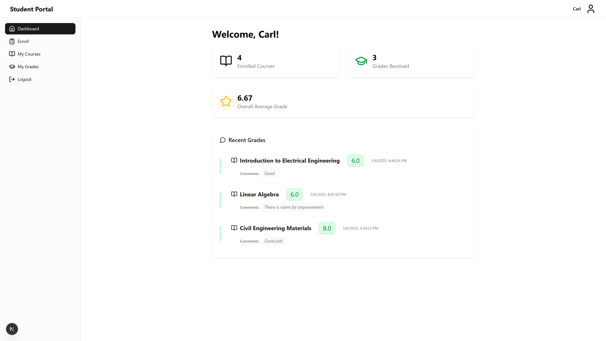
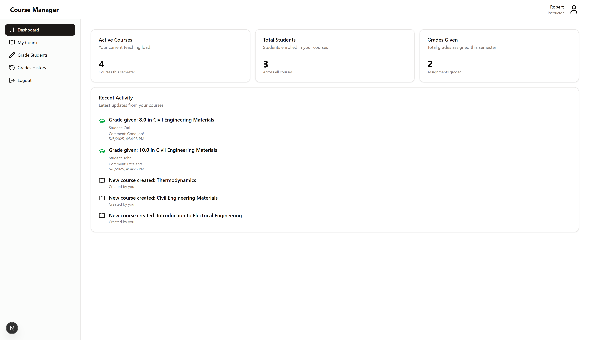

# Course Manager Frontend

A modern, full-featured course management web application for instructors and students, built with **Next.js**, **React**, and a modular, scalable architecture.

## Features

### Instructor View
- **Dashboard:** Overview of courses, students, and grading activity.
- **My Courses:** Create, view, and (soon) edit/delete courses.
- **Grade Students:** Batch grade students.
- **Grades History:** Read-only history of all grades given.

### Student View
- **Dashboard:** Summary cards for enrolled courses, grades average and recent grades.
- **Enroll:** Browse all courses, enroll in new ones, see enrollment status.
- **My Courses:** List of all enrolled courses.
- **My Grades:** Table of all grades received.

### Admin View
- **Work in progress**

### General
- **Authentication:** Role-based login and registration (student, instructor, admin).
- **Responsive UI:** Clean, modern design with Lucide icons and Tailwind CSS.
- **Robust State Management:** Context providers for both instructor and student areas.
- **API Integration:** Connects to a RESTful backend (see `Course managaer API.yaml`).

---

## Technologies
- **React**
- **Tailwind**
- **Next.js**

## Getting Started

### Installation

```bash
git clone https://github.com/yourusername/frontGestorCursos.git
cd frontGestorCursos
npm install
```

### Environment Setup

Copy `.env_template` to `.env` and fill in your API server details:

```bash
cp .env_template .env
```

### Running the App

```bash
npm run dev
```

Visit [http://localhost:3000](http://localhost:3000) in your browser.

---

### Running the backend

For setting up the RESTfull API course manager, see [the backend project](https://github.com/BrunoSpoletini/gestorCursos)

## Project Structure

```
src/
  app/
    instructor/    # Instructor dashboard, courses, grading, grades
    student/       # Student dashboard, enroll, my-courses, my-grades
    login/         # Login page
    register/      # Registration page
  components/      # Reusable UI components
  api/             # API abstraction layer
  lib/             # Shared utilities and types
public/            # Static assets (icons, images)
```

---

## API

The app expects a backend conforming to the [Course managaer API schema](./schema.yml) OpenAPI spec, supporting:
- User registration and authentication (JWT)
- Course creation, listing, and enrollment
- Grade assignment and retrieval

---

## Roadmap / TODO

- [ ] Improve error messages
- [ ] Implement Edit and Delete for courses (backend + frontend)
- [ ] Implement admin view
- [ ] Improve type safety

---

## Images

### App Screenshots

#### Student View



#### Instructor View



